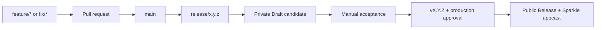

<div align="center">
  
  <h1>Floatick</h1>
  <p><strong>A calm, local-first floating todo list for macOS.</strong></p>
  <p>
    Keep tasks one click away without giving up your desktop or your data.
  </p>
  <p>
    <a href="https://github.com/lucaslushuo/floatick/actions/workflows/ci.yml">
      
    </a>
    
    
    <a href="./LICENSE">
      
    </a>
  </p>
  <p>
    <strong>English</strong> · <a href="./README.zh-CN.md">简体中文</a>
  </p>
</div>

Floatick rests above your workspace as a small, draggable icon. Click it and the
icon expands into a focused todo panel; collapse it and the icon returns to the
same anchor. The panel chooses its expansion direction from the available screen
space, so it stays useful near any display edge.

## Highlights

- **Always within reach** — drag the floating icon anywhere, then click to open.
- **Fast task flow** — create, edit, complete, search, archive, restore, and
  organize tasks in automatic daily sections.
- **Local by default** — no account, cloud service, or telemetry. Your todo data
  remains in `~/.floatick`.
- **Made for macOS** — transparent AppKit window behavior, keyboard shortcuts,
  context-menu Quit, and support for Reduce Motion.
- **Comfortable in any workspace** — system, light, and dark themes with English
  and Simplified Chinese.
- **Built-in updates** — automatic and manual update checks powered by Sparkle.

## Download

Download the latest DMG from
[GitHub Releases](https://github.com/lucaslushuo/floatick/releases), open it,
and drag Floatick into `Applications`. Release packages are universal binaries
for both Apple silicon and Intel Macs.

### A quick first-launch note

Floatick is still an early preview and current downloads are not yet signed and
notarized with an Apple Developer ID. macOS may ask for one extra confirmation
the first time you open it:

1. Try to open Floatick once.
2. Open **System Settings → Privacy & Security**.
3. Find Floatick in the **Security** section and choose **Open Anyway**.
4. Confirm **Open**.

This confirmation is normally needed only once. For more detail, see
[Apple's guide to opening an app from an unidentified developer](https://support.apple.com/guide/mac-help/open-a-mac-app-from-an-unknown-developer-mh40616/mac).
Only download Floatick from this repository's Releases page.

## Everyday use

| Action | How |
| --- | --- |
| Reposition Floatick | Drag the floating icon |
| Open the todo list | Click the floating icon |
| Collapse the panel | Click the collapse button or press `Esc` |
| Create a todo | Press `⌘N`, or use the input at the top |
| Search | Press `⌘F` |
| Edit a todo | Hover over the item and choose Edit |
| Complete a todo | Select its checkbox |
| Archive or restore | Use the action at the end of the item |
| Quit Floatick | Right-click the floating icon and choose Quit |

## Local data and privacy

Floatick creates its working directory on first launch:

| Path | Purpose |
| --- | --- |
| `~/.floatick/todos.json` | Todos, completion state, and archive state |
| `~/.floatick/settings.json` | Theme and language preferences |

Sparkle stores the automatic-update preference in standard macOS application
preferences. Floatick does not require an account and does not upload your todo
data. Network access is used only to check for and download application updates.

## Development

### Requirements

- macOS 10.15 or later
- Flutter `3.44.7`
- A complete Xcode installation

### Run locally

```bash
flutter pub get
flutter run -d macos
```

If Flutter cannot find Xcode, finish Xcode's first-launch setup:

```bash
sudo xcode-select --switch /Applications/Xcode.app/Contents/Developer
sudo xcodebuild -runFirstLaunch
```

### Verify a change

```bash
dart format --output=none --set-exit-if-changed lib test
flutter analyze
flutter test
flutter build macos --release
```

The release app is written to
`build/macos/Build/Products/Release/Floatick.app`.

## Project structure

```text
lib/
  app/          App composition and themes
  core/         Shared platform, storage, and UI primitives
  features/     Todo, settings, and update features
  l10n/         English and Simplified Chinese resources
macos/Runner/   AppKit window shell and Sparkle integration
test/           Repository, ViewModel, and widget tests
tool/           Icon and release tooling
```

Flutter owns product UI and state. A small AppKit shell owns macOS-specific
window behavior and Sparkle. Todo data never crosses the platform channel.
See [Architecture](./docs/ARCHITECTURE.md) for the dependency boundaries.

## Development and release model



Daily work reaches `main` through pull requests. A `release/x.y.z` branch builds
a private Draft candidate for manual testing. A stable `vX.Y.Z` tag promotes
the exact accepted DMG after production approval; the release workflow does not
rebuild it.

Read the [development and release workflow](./docs/RELEASING.md) before
preparing a release.

## Contributing

[Issues](https://github.com/lucaslushuo/floatick/issues) and focused pull
requests are welcome. Please keep changes scoped, add tests for meaningful
behavior, and preserve the local JSON data contract.

## License

Floatick is available under the [MIT License](./LICENSE).

© 2026 lucaslushuo
