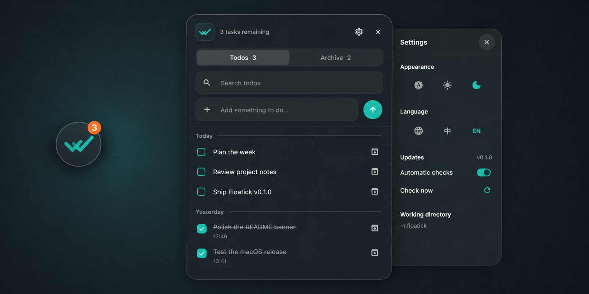
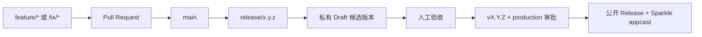

<div align="center">
  
  <h1>Floatick — macOS 悬浮待办清单</h1>
  <p><strong>一款开源、仅存本地的 macOS 待办应用与轻量任务管理工具。</strong></p>
  <p>
    无需账号或云服务，让任务记录与整理始终触手可及。
  </p>
  <p>
    <a href="https://github.com/lucaslushuo/floatick/actions/workflows/ci.yml">
      
    </a>
    
    
    <a href="./LICENSE">
      
    </a>
  </p>
  <p>
    <a href="./README.md">English</a> · <strong>简体中文</strong>
  </p>
</div>

Floatick 是一款支持离线使用的 macOS 桌面待办应用。它平时以一个小巧、
可拖动的图标悬浮在工作区上方；点击图标会展开专注的待办面板，收起后则会准确
回到原来的锚点。面板还会根据图标附近的屏幕空间自动选择展开方向，因此放在
屏幕边缘也能自然使用。

## 专注而轻量的 macOS 任务管理工具

- **随时可用**——图标可以拖到任意位置，点击即可展开。
- **完整待办流程**——支持创建、编辑、完成、搜索、归档和恢复，并按天自动分组。
- **默认仅存本地**——不需要账号、云服务或遥测，待办数据保存在 `~/.floatick`。
- **贴合 macOS**——使用 AppKit 管理透明悬浮窗口，支持快捷键、右键退出和
  “减少动态效果”。
- **适应不同工作环境**——支持跟随系统、浅色和深色主题，以及英文和简体中文。
- **内置更新能力**——通过 Sparkle 支持自动检查和手动检查更新。

## 下载 Floatick macOS 版

从 [GitHub Releases](https://github.com/lucaslushuo/floatick/releases)
下载最新 DMG，打开后将 Floatick 拖入 `Applications`。发布包是 Universal
Binary，同时支持 Apple 芯片和 Intel Mac。

### 首次启动的小提示

Floatick 目前仍处于早期预览阶段，下载包暂未使用 Apple Developer ID 完成签名
和公证。因此，macOS 第一次打开时可能需要额外确认一次：

1. 先尝试打开一次 Floatick。
2. 打开**系统设置 → 隐私与安全**。
3. 在**安全性**区域找到 Floatick，点击**仍要打开**。
4. 再次确认**打开**。

这项确认通常只需要完成一次。更多说明可以查看
[Apple 官方帮助](https://support.apple.com/guide/mac-help/open-a-mac-app-from-an-unknown-developer-mh40616/mac)。
请只从本仓库的 Releases 页面下载 Floatick。

## 日常操作

| 操作 | 使用方式 |
| --- | --- |
| 调整位置 | 拖动悬浮图标 |
| 展开待办列表 | 点击悬浮图标 |
| 收起面板 | 点击收起按钮或按 `Esc` |
| 创建待办 | 按 `⌘N`，或使用顶部输入框 |
| 搜索 | 按 `⌘F` |
| 编辑待办 | 将鼠标悬浮到待办上并点击编辑 |
| 完成待办 | 点击待办前的复选框 |
| 归档或恢复 | 使用待办末尾的操作按钮 |
| 退出 Floatick | 右键点击悬浮图标并选择退出 |

## 本地数据与隐私

Floatick 第一次启动时会自动创建工作目录：

| 路径 | 用途 |
| --- | --- |
| `~/.floatick/todos.json` | 待办、完成状态与归档状态 |
| `~/.floatick/settings.json` | 主题与语言设置 |

Sparkle 会将自动更新偏好保存在 macOS 标准应用偏好中。Floatick 不需要账号，
也不会上传待办数据；网络访问仅用于检查和下载应用更新。

## 本地开发

### 环境要求

- macOS 10.15 或更高版本
- Flutter `3.44.7`
- 完整安装的 Xcode

### 运行项目

```bash
flutter pub get
flutter run -d macos
```

如果 Flutter 无法找到 Xcode，请先完成 Xcode 的首次配置：

```bash
sudo xcode-select --switch /Applications/Xcode.app/Contents/Developer
sudo xcodebuild -runFirstLaunch
```

### 验证改动

```bash
dart format --output=none --set-exit-if-changed lib test
flutter analyze
flutter test
flutter build macos --release
```

Release 应用位于
`build/macos/Build/Products/Release/Floatick.app`。

## 项目结构

```text
lib/
  app/          应用装配与主题
  core/         共享的平台、存储和 UI 基元
  features/     Todo、设置和更新功能
  l10n/         英文与简体中文资源
macos/Runner/   AppKit 窗口外壳与 Sparkle 集成
test/           Repository、ViewModel 和 Widget 测试
tool/           图标与发布工具
```

Flutter 负责产品 UI 和状态；轻量 AppKit 外壳负责 macOS 专属窗口行为与
Sparkle。待办数据不会经过平台通道。依赖边界详见
[架构说明](./docs/ARCHITECTURE.md)。

## 开发与发布模型



日常改动通过 Pull Request 进入 `main`。`release/x.y.z` 分支会生成用于
人工测试的私有 Draft；验收通过后，对完全相同的候选提交打 `vX.Y.Z` 标签，
经过 production 审批后直接晋级已测试的 DMG，正式发布阶段不会重新构建。

准备发布前，请先阅读完整的
[开发与发布流程](./docs/DEVELOPMENT_WORKFLOW.md)。

## 参与贡献

欢迎提交 [Issue](https://github.com/lucaslushuo/floatick/issues) 和范围清晰的
Pull Request。请为有意义的行为变更补充测试，并保持本地 JSON 数据格式向后
兼容。

## 许可证

Floatick 使用 [MIT License](./LICENSE)。

© 2026 lucaslushuo
