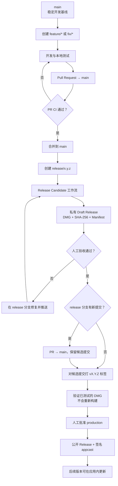

# Floatick 开发与发布流程

一句话概括：

> 日常改动通过 PR 进入 `main`；发布时先生成私有 Draft 候选包，人工测试通过后，
> 再对同一个候选提交打版本标签并批准正式发布。

## 流程图



## 分支和标签

| 名称 | 用途 | 是否发布安装包 |
| --- | --- | --- |
| `main` | 稳定开发基线，只接受 PR | 否 |
| `feature/*` | 新功能 | 否 |
| `fix/*` | Bug 修复 | 否 |
| `release/x.y.z` | 版本冻结、候选测试和发布前修复 | 仅生成私有 Draft |
| `candidate/vX.Y.Z` | 工作流管理的临时候选标签 | 仅关联 Draft |
| `vX.Y.Z` | 已验收版本的正式标签 | 等待 production 批准 |

不使用长期 `develop` 或 `master` 分支。

## 日常开发

### 1. 创建开发分支

```bash
git fetch origin
git switch main
git pull --ff-only
git switch -c feature/short-description
```

修复 Bug 时使用 `fix/short-description`。

### 2. 开发和本地验证

- 修改代码前先确认根因和影响范围。
- 核心逻辑补单元测试；交互变更补 Widget 测试。
- 优先运行与改动直接相关的测试。
- 本地需要观察 UI 时运行：

```bash
flutter run -d macos
```

### 3. 提交并创建 PR

```bash
git add -A
git commit -m "feat: describe the change"
git push -u origin feature/short-description
```

PR 必须合入 `main`。PR CI 会执行：

1. Dart 格式检查；
2. `flutter analyze`；
3. `flutter test`；
4. macOS Release 构建；
5. `arm64` 和 `x86_64` 双架构检查。

CI 通过后才能合并。普通开发不直接推送 `main`。

## 构建候选版本

### 1. 冻结版本

从准备发布的 `main` 提交创建发布分支：

```bash
git fetch origin
git switch main
git pull --ff-only
git switch -c release/0.1.0
```

`pubspec.yaml` 必须包含公开版本和递增的构建号：

```yaml
version: 0.1.0+1
```

### 2. 生成 Draft Release

```bash
git push -u origin release/0.1.0
```

每次推送 `release/0.1.0` 都会重新运行候选工作流，生成：

- Universal macOS DMG；
- SHA-256 校验文件；
- Release Manifest；
- 仅维护者可见的 Draft Release。

不要在 GitHub 页面手动发布 Draft。

### 3. 人工验收

从 Draft 下载 DMG，至少检查：

- 安装、首次启动和 Gatekeeper 提示；
- 悬浮图标拖动、展开、收起和右键退出；
- Todo 创建、编辑、完成、搜索、归档和恢复；
- 中英文、深浅色主题与设置持久化；
- `~/.floatick` 数据在重启后保持不变；
- 更新检查、CPU、内存和动画表现。

如果失败，直接在同一个 `release/x.y.z` 分支修复并推送。工作流会替换 Draft
中的候选文件。旧候选不能打正式标签。

## 正式发布

### 1. 确保候选提交位于 `main`

如果候选测试期间产生了修复提交，先创建 `release/x.y.z → main` PR，并使用
merge commit 合并。不要 squash 或 rebase 候选提交。

### 2. 标记经过测试的准确提交

```bash
git fetch origin
candidate_sha=$(git rev-parse origin/release/0.1.0)
git merge-base --is-ancestor "$candidate_sha" origin/main
git tag -a v0.1.0 "$candidate_sha" -m "Floatick 0.1.0"
git push origin v0.1.0
```

标签必须指向 Draft 对应的候选提交，不能指向另一个重新构建的提交。

### 3. 验证和人工批准

正式工作流会验证：

- 标签、`pubspec.yaml` 和应用版本一致；
- 候选提交已进入 `main`；
- 正式标签与候选标签指向同一提交；
- DMG、SHA-256、Manifest、版本和双架构一致。

验证通过后，工作流会等待人工操作：

`Review deployments → production → Approve and deploy`

批准后才会：

1. 读取 Sparkle EdDSA 私钥；
2. 签名并部署 `appcast.xml`；
3. 将已测试的 Draft 转为公开 Release；
4. 删除临时 `candidate/vX.Y.Z` 标签；
5. 发布 GitHub Pages 更新源。

正式工作流不会重新构建 DMG。

## 应用内更新

Floatick 使用以下 Sparkle 更新源：

```text
https://lucaslushuo.github.io/floatick/appcast.xml
```

- 首个正式版本发布前，该文件还不存在，候选包会显示“更新服务暂未就绪”。
- 发布 `v0.1.0` 并批准 production 后，工作流会部署签名 appcast。
- `v0.1.0` 需要用户手动下载安装一次。
- 从后续版本开始，旧版本会通过 Sparkle 发现、下载、验证并安装更新。

Sparkle EdDSA 保护更新链路，但不能替代 Apple Developer ID 签名和公证。

## Hotfix

生产版本出现紧急问题时，从最新稳定标签创建补丁发布分支：

```bash
git switch -c release/0.1.1 v0.1.0
```

提高公开版本和构建号，然后继续使用同一套：

`Draft → 人工验收 → 合入 main → 正式标签 → production 批准`

## 谁负责什么

| 角色 | 责任 |
| --- | --- |
| 开发者 | 开发、测试、提交、PR 和候选修复 |
| GitHub Actions | CI、候选构建、文件校验、Release 和 appcast 部署 |
| 维护者 | 下载候选 DMG 验收、确认正式标签、批准 production |

## 必须遵守

- 不直接推送 `main`。
- 不手动公开 Draft Release。
- 不给未测试提交打正式标签。
- 不用重新构建的文件替换已验收候选包。
- 不把 Sparkle 私钥或其他 Secrets 写入仓库和日志。

更完整的发布检查项见 [RELEASING.md](RELEASING.md)。
